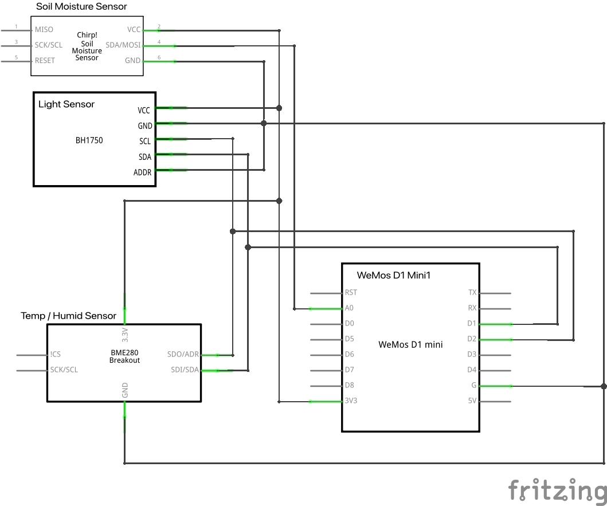
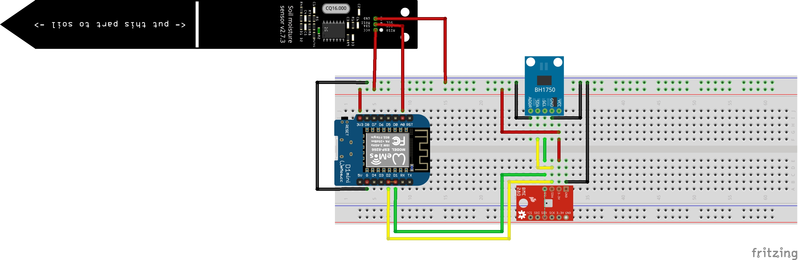

# AgriNode Hardware Documentation

This document provides detailed information about the hardware setup for the AgriNode project, including the required components, wiring, and assembly instructions.

---

## Components

### Microcontroller
- **WEMOS D1 Mini (ESP8266-based)**

### Sensors
- **Soil Moisture Sensor**: Capacitive sensor (e.g., DFRobot Gravity or Makerfabs Lora Soil Moisture Sensor V3)
- **Brightness Sensor**: BH1750 Digital Light Sensor
- **Temperature and Humidity Sensor**: BME280 or DHT22

### Power Supply
- **Battery**: LiPo (3.7V) or 18650 Li-Ion
- **Battery Management**: TP4056 charging module or similar
- **Optional Solar Module**: 5V-6V, 1W-3W with a solar LiPo charger

### Additional Components
- Connecting cables
- Breadboard (for prototyping)
- 3D printing material (for housing)

---

## Wiring

### Circuit Diagram

Below is the circuit diagram for the AgriNode hardware setup. Ensure all connections are made as per the diagram.

### Breadboard Layout

The breadboard layout provides a visual guide for prototyping the hardware connections.

---

## Sensor Connections

### Soil Moisture Sensor
- **Analog Output**: Connect to A0 on the WEMOS D1 Mini.
- **Power**: Connect VCC to 3.3V and GND to GND.

### BME280
- **SDA**: Connect to D2 (GPIO4).
- **SCL**: Connect to D1 (GPIO5).
- **Power**: Connect VCC to 3.3V and GND to GND.

### BH1750
- **SDA**: Connect to D2 (GPIO4).
- **SCL**: Connect to D1 (GPIO5).
- **Power**: Connect VCC to 3.3V and GND to GND.

### DHT22 (Optional)
- **Data Pin**: Connect to D4 (GPIO2).
- **Power**: Connect VCC to 3.3V or 5V and GND to GND.
- **Pull-Up Resistor**: Place a 4.7kΩ - 10kΩ resistor between the data pin and VCC.

---

## Assembly Instructions

1. **Connect Sensors**: Wire all sensors to the WEMOS D1 Mini as per the circuit diagram.
2. **Power Supply**: Attach the battery and optional solar module with the charging module.
3. **Test Connections**: Verify all connections using a multimeter.
4. **Prototype**: Assemble the components on a breadboard for testing.
5. **Finalize**: Once tested, solder the components onto a PCB or perfboard for a permanent setup.

---

## Notes

- Ensure proper insulation to avoid short circuits.
- Use a voltage divider if the soil moisture sensor outputs a voltage higher than 3.3V.
- For long-term outdoor use, consider waterproofing the sensors and housing.

For further details, refer to the [README](../README.md) or the [API Documentation](./api.md).
